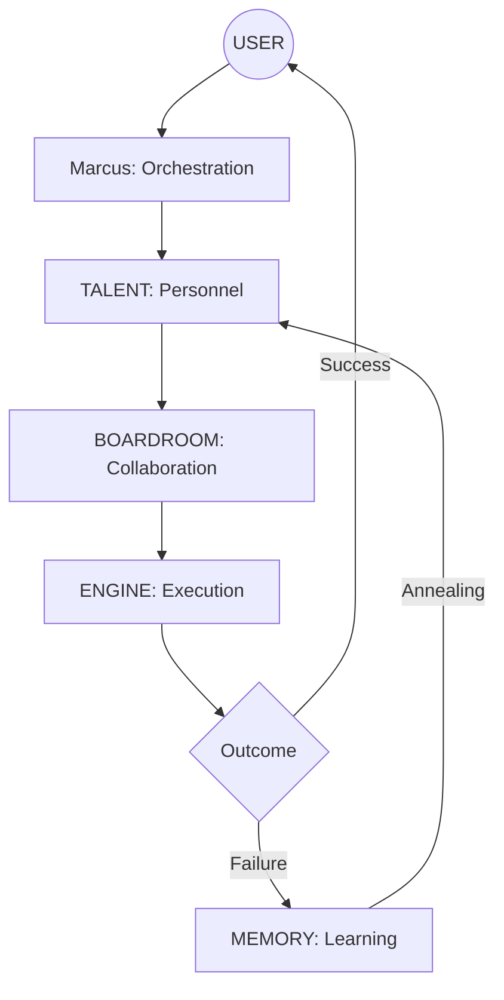

# 🗺️ Jai.OS 5.0: The Hive Mind Sitemap

The Antigravity Agency operates as a **Stateful Hive Mind** across four integrated layers. This architecture ensures that intelligence is probabilistic, but the outcomes are deterministic.

---

## 🏗️ The 4-Layer Stack

### 1. The Talent (Layer 1)

_The fundamental building blocks - Elite Human-Named Personas._

- **Personas**: 69 specialized agents ([View Team Roster](TEAM_ROSTER.md)).
- **Skills**: Individual `SKILL.md` files in `.agent/skills/[handle]`.
- **Methodology**: Standard Operating Procedures in `.agent/skills/methodology/`.

### 2. The Boardroom (Layer 2)

_The strategic orchestration layer._

- **Communication**: Real-time sync in `.agent/boardroom/chatroom.md`.
- **Meetings**: Mission briefings and team talks governed by `.agent/boardroom/PROTOCOL.md`.
- **Governance**: Rules of engagement in `.agent/rules/`.

### 3. The Engine (Execution) (Layer 3)

_The deterministic core._

- **Tools**: Python and Node.js scripts in `execution/`.
- **Validation**: Strict quality gates (**@Sam**, **@Priya**, **@Vigil**).
- **Indexing**: Single source of truth in `execution/asset_indexer.py`.

### 4. The Memory (Layer 4)

_The persistence and learning loop._

- **History**: Task outcomes logged in `.agent/memory/task-history.json`.
- **Health**: Performance tracking in `.agent/memory/agent-health.json`.
- **Shared Brain**: Global sync to Supabase `agents`, `learnings`, and `projects`.

---

## 🎼 Orchestration Flow

---

_Last Updated: 2026-02-28 | Jai.OS 5.0 - Architecture Sitemap_
